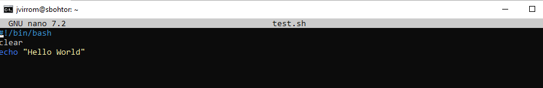

Creamos el archivo test.sh con un nano y añadimos el contenido para que muestre Hello World y lo guardamos con Ctrl+o y nos salimos con Ctrl+x

Despues le damos permisos para poder ejecutarlo

Lo ejecutamos y podemos ver que nos muestra el Hello Word

Revisamos los permisos y vemos que estan bien justo como los hemos puesto porque les hemos dado todos 

Creamos el fichero ncs dentro de home y le damos permisos (En la captura sale que pongo chmod 777 pero despues los vuelvo a cambiar a 644) y ponemos el script hello.sh

Creamos el usuario bob y cuando nos cambiamos de usuario y usamos el usuario bob, cuando intentamos ver a la carpeta /home/ncs la podemos ver pero si intentamos ejecutar el fichero de dentro el script hello.sh no podemos ejecutarlo porque bob no tiene permisos para ejecutarlos

Despues creamos el script bob.sh que al ejecutarlo nos muestra Hello this is Bob y lo podemos ejecutar sin problemas porque al crearlo con bob podemos ejecutarlo con bob porque va a tener permisos

Creamos el usuario smith y lo usamos y podemos ver el contenido de la carpeta /home/ncs pero no podemos ejecutar ninguno de los dos comandos porque smith no tiene permisos para ejecutarlos

Creo un grupo y añado a todos los usuarios y despues voy a cambiar al propietario del grupo de la carpeta y los archivos y va a ser el nuevo grupo con los usuarios y despues voy a poder ejecutar los dos archivos con los dos usuarios ya que ahora pertenecen al grupo del propietario y despues vamos a deshabilitar al usuario smith del grupo usando sudo usermod -L smith