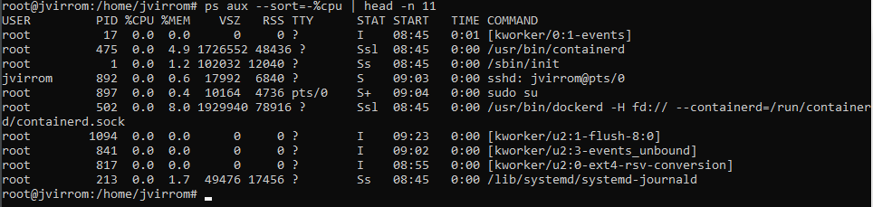

Muestra al usuario bob y sus detalles

Con el comando top podemo ver los detllaes de los procesos aunque tambien podemos usar el ps aux
o el htop que el htop es igual pero mas intuitivo y con colores y el ps aux es estatico

Podemos ver con nmap que nos muestra los puertos abiertos y sus serviciios asociados

Con el comando ps aux | wc -l podemos contar el numero total de procesos en ejecución en el sistema

El comando ps aux --sort=-%cpu | head -n 11 se utiliza para mostrar los 10 procesos 
más intensivos en CPU, ordenados de mayor a menor uso de CPU

Con el comando kill -l muestra una lista de todas las señales disponibles que se pueden 
usar con el comando kill para enviar señales a los procesos

**1	SIGHUP**	Indica que el terminal ha sido cerrado o que el proceso debe recargar su configuración.

**2	SIGINT**	Señal enviada por Ctrl+C para interrumpir un proceso.

**3	SIGQUIT**	Similar a SIGINT, pero genera un volcado de núcleo (core dump).

**9	SIGKILL**	Termina un proceso de manera forzada (no puede ser ignorada por el proceso).

**15 SIGTERM**	Señal para solicitar que un proceso termine de manera "normal".

**19 SIGSTOP**	Detiene un proceso (similar a pausar el proceso).

**18 SIGCONT**	Reanuda un proceso detenido con SIGSTOP.

**28 SIGWINCH**	Se utiliza cuando se cambia el tamaño de la ventana de un terminal.

Aqui podemos ver como editamos el fichero inetd.conf para poder usar los servicios telnet y ftp,
aunque tendremos que instalar aparte el telnetd para poder usar el servicio telnet y despues para
deshabilitar el ftp comentamos su linea de configuracion y cuando lo ejecutamos nos sale
un mensaje de error indicando que el servicio no está disponible

Configuramos el fichero vsftpd.conf y añadimos la linea allow_writeable_chroot=YES
que sirve para autorizar a root en ftp