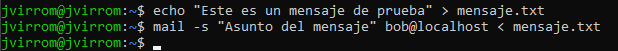
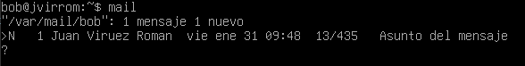

## Ejercicio 6.1

Creamos un fichero txt con un mensaje cualquiera para hacer la prueba y despues se lo enviamos a bob con un asunto para ver si le llega

## Ejercicio 6.2

Aqui podemos ver como poniendo mail desde el usuario de bob tiene un correo con el ausnto que le hemos puesto

## Ejercicio 6.3

### 1. Uso del comando mail

Leer: mail

Responder: Abre un correo, escribe r, redacta el mensaje y presiona Ctrl+D.

Enviar: mail -s "Asunto" usuario@dominio.com, escribe el mensaje y Ctrl+D.

Eliminar: d <número> dentro de mail.

Listar: mail o mail -u bob (para todos los mensajes).

Guardar: s <número> archivo

### 2. Contenido de /var/spool/mail/
Contiene los correos de cada usuario. Riesgos:

Permisos incorrectos pueden permitir accesos no autorizados.

Root puede leer y modificar todos los correos.

Posibles ataques si se manipula incorrectamente.

Verifica permisos con:
#### ls -l /var/spool/mail/

###  3. Enviar un correo con Telnet (SMTP, puerto 25)
Desde Windows:

- telnet <ip_vm> 25

Luego:

- HELO localhost  
- MAIL FROM: tu_nombre@localhost  
- RCPT TO: bob@localhost  
- DATA  
- Subject: Prueba  
- Mensaje de prueba  
- .  
- QUIT

Revisar en la Maquina Virtual con mail.

### 4. Habilitar POP3

Edita /etc/inetd.conf o /etc/xinetd.d/pop3.

Descomenta la línea de POP3 si es necesario.

Guarda y reinicia el servicio:

- sudo systemctl restart inetd

### 5. Conectar a POP3 con Telnet (puerto 110)

Desde Windows:

- telnet <ip_vm> 110

Comandos básicos:

- USER bob  
- PASS <contraseña>  
- LIST  
- RETR 1  
- QUIT  

### 6. Puertos usados por SMTP y POP3
SMTP: 25

POP3: 110

IMAP (alternativa a POP3): 143

## Ejercicio 6.4

### 1. IMAP vs. POP3

IMAP: Los correos quedan en el servidor, sincroniza en varios dispositivos.

POP3: Descarga los correos al dispositivo, no sincroniza.

Diferencias clave:

- IMAP	

Correos en servidor	

Sincronización	

Requiere más espacio en servidor	

- POP3

Correos en local

Sin conexión entre dispositivos

Menos espacio en servidor

### 2. ¿Qué es PGP?
PGP (Pretty Good Privacy) cifra correos para privacidad y autenticidad.

Usa clave pública para cifrar y clave privada para descifrar.

Permite firmas digitales para verificar el remitente.