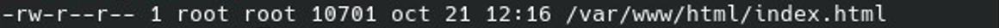
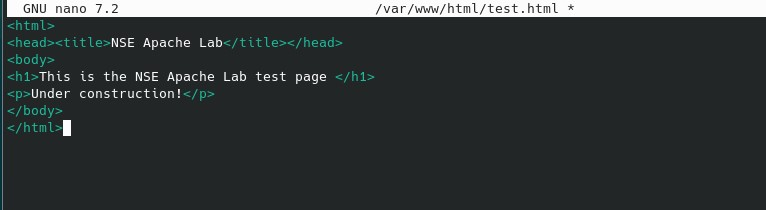
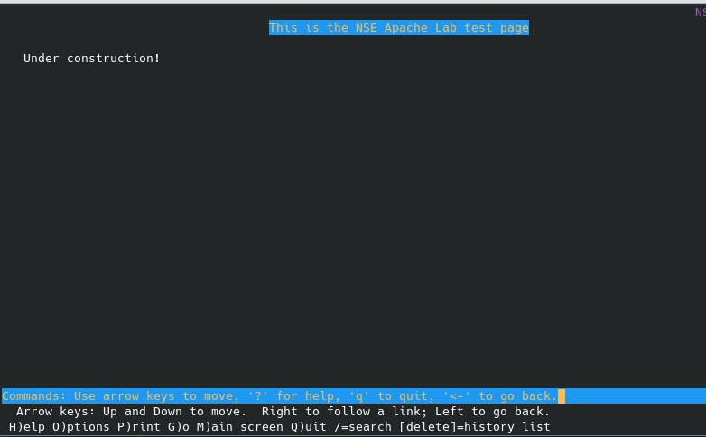
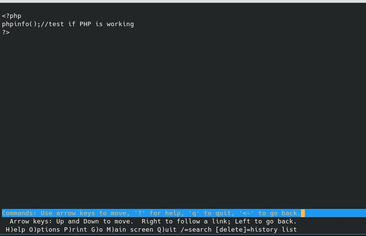
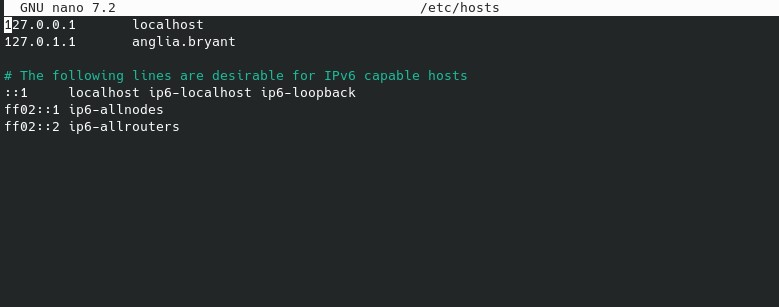
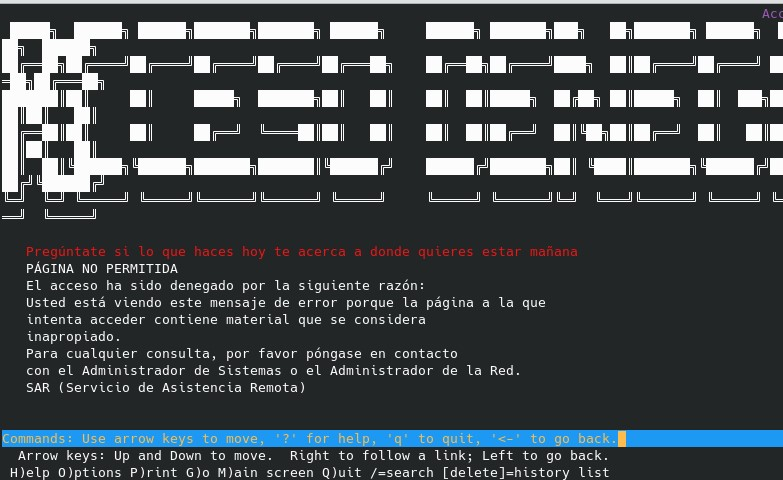

# PHP Debian

## Ejercicio 7.1: Configuración de Apache

### Propósito de los comentarios (#) en httpd.conf

Los comentarios sirven para aclarar configuraciones sin alterar el funcionamiento del servidor. También se usan para desactivar líneas de configuración sin eliminarlas.

### Valores por defecto de ServerName y DocumentRoot

ServerName especifica el nombre del servidor (por ejemplo: localhost).
DocumentRoot es la ubicación donde se guardan los archivos web, generalmente /var/www/html.

### Efecto de Include /etc/httpd/mod_php.conf

Permite cargar el módulo PHP en Apache, habilitando la ejecución de scripts PHP.

## Ejercicio 7.2: Ejecutando Apache

### Por qué reiniciar httpd tras cambios en la configuración

Apache necesita recargar sus archivos de configuración para aplicar los cambios realizados.

### Análisis del comando ps aux | grep httpd

ps aux muestra los procesos en ejecución.
grep httpd filtra los procesos relacionados con Apache.
| es un operador que pasa la salida de un comando como entrada de otro.

### Salida esperada de ps aux | grep httpd

Si httpd está activo, se listarán varios procesos de Apache.

Si no está activo, solo se mostrará la línea de grep httpd.

## Ejercicio 7.3: Creando archivos HTML

### ¿Qué tiene de especial index.html?

Es la página predeterminada que Apache carga si no se especifica otra.

### Permisos y propietario del archivo index.html

ls -l /var/www/html/index.html

### Creando test.html

sudo nano /var/www/html/test.html

## Ejercicio 7.4: Viendo archivos HTML en terminal

### Diferencia entre CLI y GUI

CLI utiliza comandos de texto, mientras que GUI tiene una interfaz gráfica.

### ¿Qué tiene de especial 127.0.0.1?

Es la dirección local del sistema (localhost).

### Ver test.html en lynx

sudo apt install lynx
lynx 127.0.0.1/test.html

## Ejercicio 7.5: Creando y viendo archivos PHP

### Función de phpinfo();

Muestra información sobre PHP, los módulos instalados y la configuración.

### Ver nse.php en lynx

sudo nano /var/www/html/nse.php

lynx 127.0.0.1/nse.php

## Ejercicio 7.6: Modificando el archivo hosts

### Abrir /etc/hosts y agregar ServerName

sudo nano /etc/hosts

### Agrega 127.0.0.1 www.ejemplo.com

lynx www.ejemplo.com

