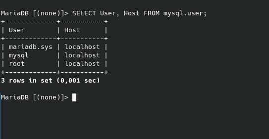
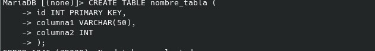
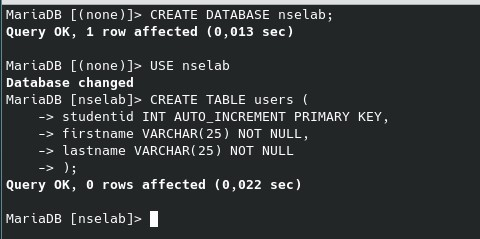
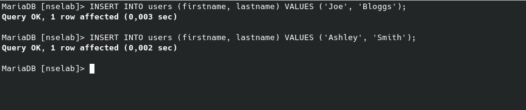
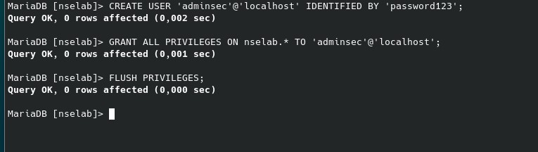
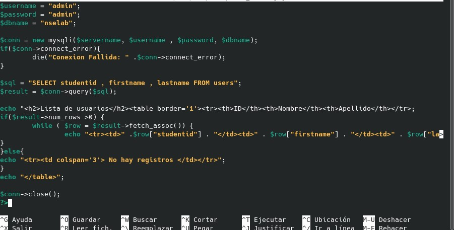

# Ejercicio 8.1

# Para contar el número de registros en la tabla de usuarios de la base de datos mysql:

SELECT User, Host FROM mysql.user;

# Comandos SQL esenciales para manipular tablas:

## Crear una nueva tabla:

CREATE TABLE nombre_tabla (
    id INT PRIMARY KEY,
    columna1 VARCHAR(50),
    columna2 INT
);

### Borrar una tabla

DROP TABLE nombre_tabla;

### Consultar datos de una tabla

SELECT * FROM nombre_tabla;

### Añadir datos a una tabla

INSERT INTO nombre_tabla (id, columna1, columna2) VALUES (1, 'Ejemplo', 100);

## Crear la base de datos nselab y la tabla users:

CREATE DATABASE nselab;
USE nselab;

CREATE TABLE users (
    studentid INT AUTO_INCREMENT PRIMARY KEY,
    firstname VARCHAR(25) NOT NULL,
    lastname VARCHAR(25) NOT NULL
);

### Añadir los estudiantes Joe Bloggs y Ashley Smith:

INSERT INTO users (firstname, lastname) VALUES ('Joe', 'Bloggs');

INSERT INTO users (firstname, lastname) VALUES ('Ashley', 'Smith');

# Ejercicio 8.2

### Crear un usuario MySQL adminsec con permisos solo en nselab:

CREATE USER 'adminsec'@'localhost' IDENTIFIED BY 'password123';
GRANT ALL PRIVILEGES ON nselab.* TO 'adminsec'@'localhost';
FLUSH PRIVILEGES;

### Crear una página PHP para listar los usuarios en la base de datos:

Se conecta a MySQL usando mysqli.

Se ejecuta un SELECT para obtener los datos de la tabla users.

Se muestran los resultados en una tabla HTML.
