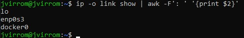
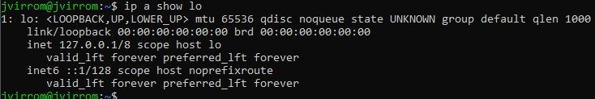
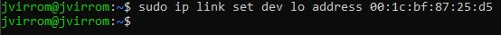
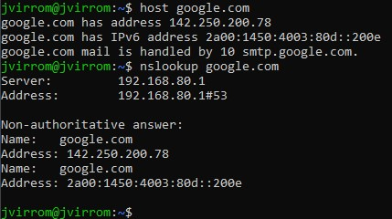
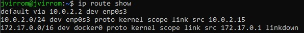
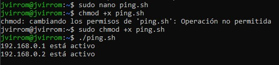

# Práctica: Análisis de Tráfico de Red


## 1. Mostrar Interfaces de Red Disponibles
Ejecuta el siguiente comando para listar las interfaces de red disponibles en tu sistema:

```bash
ip -o link show | awk -F': ' '{print $2}'
```



---

## 2. Mostrar Direcciones IP
Para ver la dirección IP de una interfaz específica:

```bash
ip a show eth0
```

Para extraer solo la dirección IP:

```bash
ip -o -4 addr show eth0 | awk '{print $4}' | cut -d'/' -f1
```

Yo voy a usar `lo` en vez de `eth0`




---

## 3. Suplantar (Spoof) la Dirección MAC
Para cambiar temporalmente la dirección MAC de la interfaz de red:

```bash
ip link set dev eth0 address 00:1c:bf:87:25:d5
```

**Nota:** Este cambio desaparece al reiniciar la máquina.




---

## 4. Realizar una Consulta DNS
Para resolver un dominio a su dirección IP:

```bash
host google.com
```

O usando `nslookup`:

```bash
nslookup google.com
```



---

## 5. Mostrar la Tabla de Rutas
Para ver la tabla de rutas de la red:

```bash
ip route show
```

Para agregar una puerta de enlace predeterminada:

```bash
ip route add default via 192.168.0.1 dev wlan0
```



---

## 6. Listar Equipos Activos en la Red
Crea un script en Bash llamado `ping.sh` para detectar máquinas activas:

```bash
#!/bin/bash
# Reemplaza 192.168.0 con el prefijo de tu red
for ip in 192.168.0.{1..255}; do
    ping -c 2 $ip &> /dev/null
    if [ $? -eq 0 ]; then
        echo "$ip está activo"
    fi
done
```

Dale permisos de ejecución:

```bash
chmod +x ping.sh
```

Ejecuta el script:

```bash
./ping.sh
```

Para detenerlo, usa `[Ctrl] + [Z]`.




